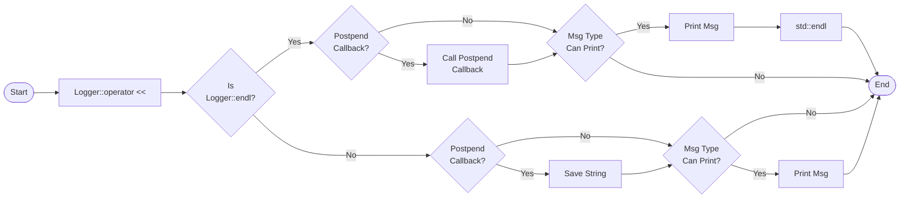

### Logger::operator << ( const char * )

```mermaid
flowchart LR
    logSSStart([Start]) --> streamOut["Logger::operator #60;#60;"]
    streamOut --> loggerEnd{Is\nLogger::endl?}
    loggerEnd -->|Yes| postpend1{Postpend\nCallback?}
    postpend1 -->|Yes| callPostpend1[Call Postpend\nCallback]
    postpend1 -->|No| printing1
    callPostpend1 --> printing1{Msg Type\nCan Print?}
    printing1 -->|Yes| printMsg1[Print Msg]
    printMsg1 --> newline[std::endl]
    newline --> logSSEnd([End])
    printing1 -->|No| logSSEnd
    loggerEnd -->|No| postpend2{Postpend\nCallback?}
    postpend2 -->|Yes| saveString[Save String]
    postpend2 -->|No| printing2{Msg Type\nCan Print?}
    saveString --> printing2
    printing2 -->|Yes| printMsg2[Print Msg]
    printing2 -->|No| logSSEnd
    printMsg2 --> logSSEnd
```
